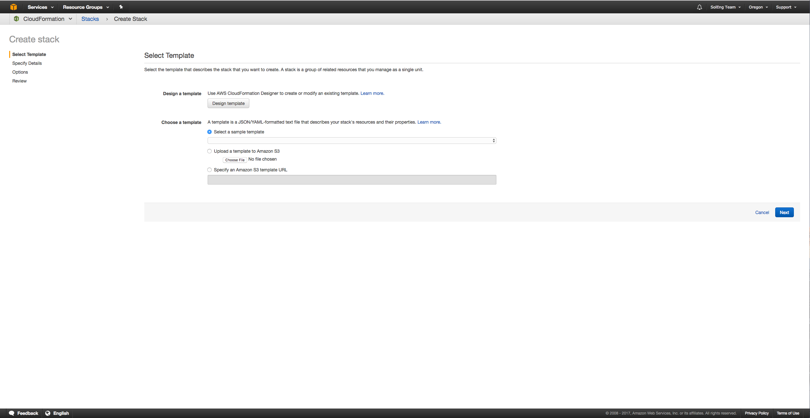
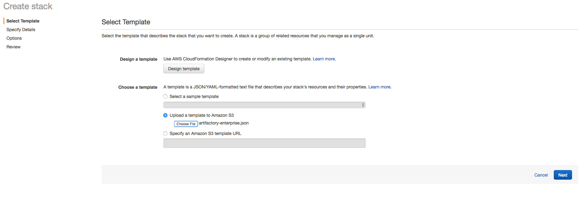
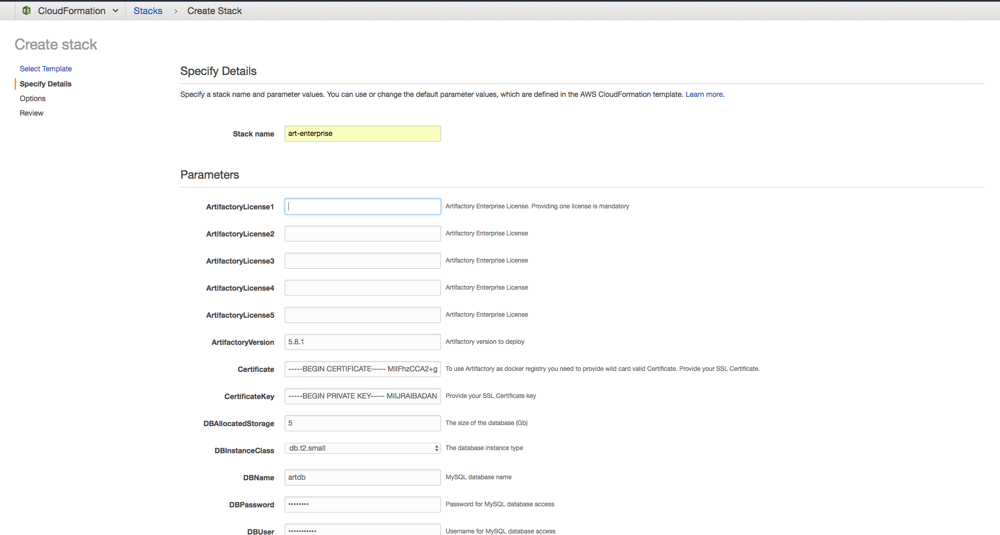
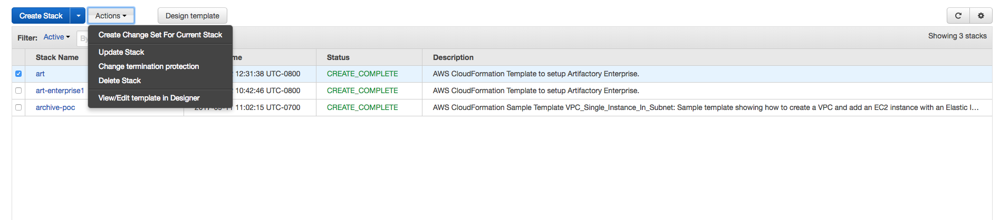
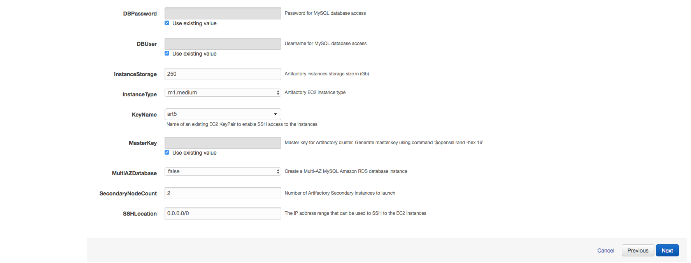
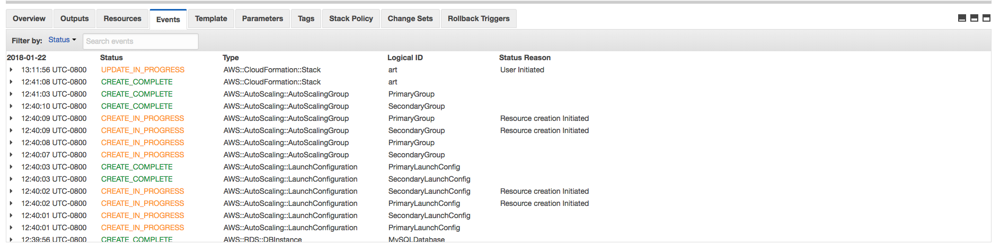
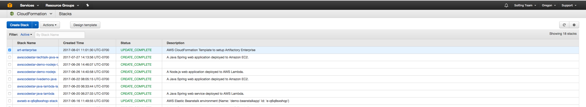
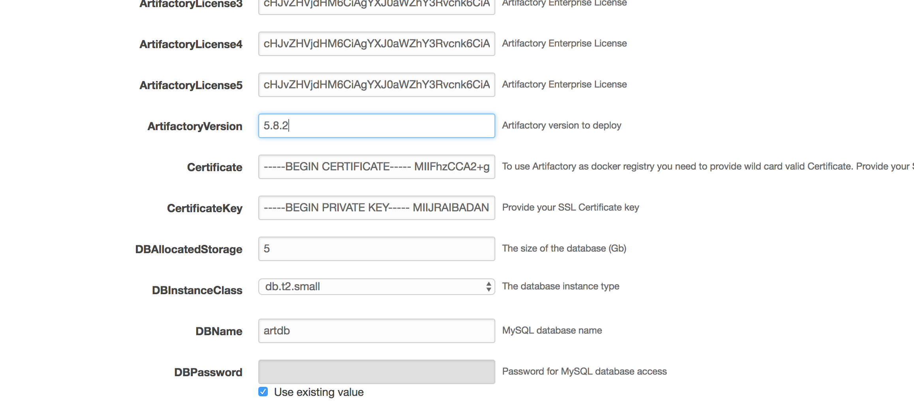
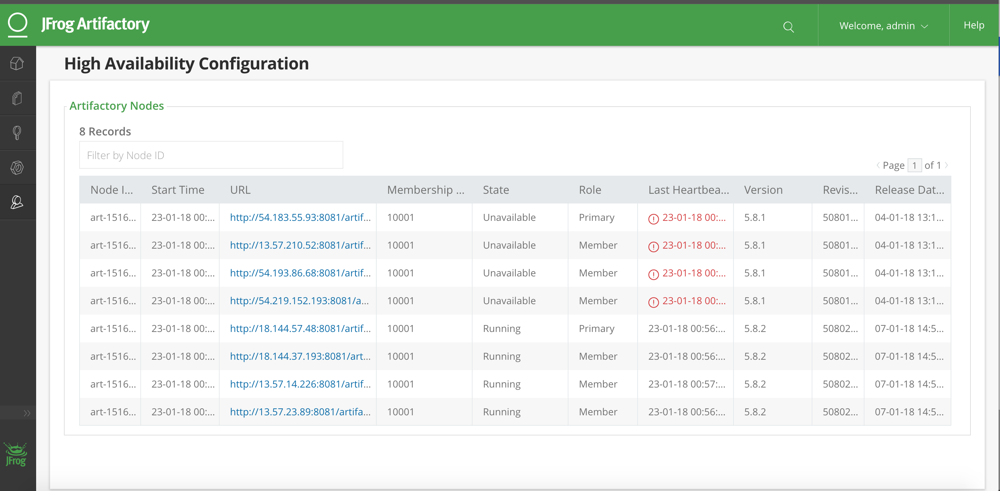

# CloudFormation Template For Artifactory Enterprise

### Steps to Deploy Artifactory Enterprise using CloudFormation template

1. Go to AWS Console and Select CloudFormation. Then click on Create Stack.
   You will see following window. 


2. Upload Artifactory-enterprise.json (Artifactory Enterprise template) and click next.


3. Provide required information like stack name, DBAllocatedStorage, DBInstanceClass, DBName, DBPassword,
   DBUser, InstanceType, InstanceStorage, MasterKey, ArtifactoryVersion, KeyName, ArtifactoryLicense1-5, MultiAZDatabase, SSHLocation, Certificate, CertificateKey, SecondaryNodeCount, ExtraJavaOptions. Then click next.


4. Mark on checkbox to allow CloudFormation to create IAM user for Artifactory to access S3 bucket.


5. Once Stack in deployed you will see Artifactory Load Balancer URL in output as showed in screenshot.


6. Open Artifactory URL and you will be able to see Artifactory UI.


7. Let's make sure that Artifactory is running in High Availability mode. Go to Admin -> High Availability in Artifactory UI to see this table.


8. Now let's add 2 more nodes to Artifactory Enterprise cluster. Go to CloudFormation UI in AWS console and select newly deployed Artifactory Enterprise Stack.
   Click on Action -> Update Stack.


9. Increase SecondaryNodeCount from 0 to 2. Then update the Stack.


10. It will take few minutes to update stack.


11. Once Stack is updated.


12. You will be able to see 3 nodes in High Availability table in Artifactory UI as part of Enterprise cluster.


### Note: 
1. This template only supports Artifactory version 5.8.x and above.
2. Turn off daily backups.  Read Documentation provided [here](https://www.jfrog.com/confluence/display/RTF/Managing+Backups)
3. Use SSL Certificate with valid wild card to you artifactory as docker registry with subdomain method.

### Steps to setup Artifactory as secure docker registry
considering you have SSL certificate for `*.jfrog.team`
1. Pass your SSL Certificate in parameter `Certificate` as string
2. Pass your SSL Certificate Key in parameter `CertificateKey` as string
3. Set `CertificateDomain` as `jfrog.team`
4. Set `ArtifactoryServerName` as `artifactory` if you want to access artifactory with `https://artifactory.jfrog.team`
5. Create DNS for example Rout53 with entry `artifactory.jfrog.team` pointing to ELB value provided as output in CloudFormation Stack.
6. Create DNS for example Route53 with entry `*.jfrog.team` pointing to ELB value provided as output in CloudFormation Stack.
7. If you have virtual docker registry with name `docker-virtual` in artifactory. You can access it via `docker-virtual.jfrog.team`
   e.g ```docker pull docker-virtual.jfrog.team/nginx```

### Steps to upgrade Artifactory Version

1. Go to AWS Console and Select CloudFormation Artifactory Stack you want to upgrade. Then click on Update Stack.

2. Change Artifactory version in parameters from old version to version you want to deploy.  
   for e.g. 5.8.1 to 5.8.2
   
   
   
3. You will see instances will get upgraded one by one. Depending on your cluster size it will take 20-30 minutes to update stack.

