**This template is deprecated. We recommend using AWS Quickstarts for JFrog for [EC2](https://aws.amazon.com/quickstart/architecture/jfrog-artifactory-amazon-ec2/), [ECS](https://aws.amazon.com/quickstart/architecture/jfrog-artifactory-amazon-ecs/), or [EKS](https://aws.amazon.com/quickstart/architecture/jfrog-artifactory-amazon-eks/). You can also use the [CloudFormation temaplates created for QuickStarts](https://github.com/aws-quickstart/quickstart-jfrog-artifactory) as a foundation for your own.**

# CloudFormation Template For JFrog Artifactory Enterprise

### Steps to Deploy Artifactory Enterprise using a CloudFormation template

1. Go to AWS Console and select **CloudFormation**. and click **Create Stack**. The following page is displayed. 
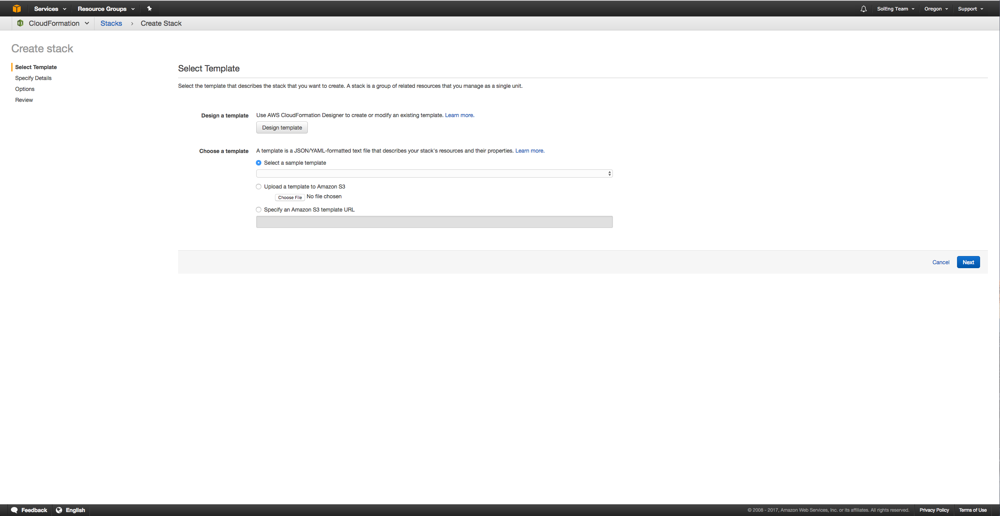

2. Upload the _Artifactory-enterprise.json_  file which is the Artifactory Enterprise template and click **Next**. 


3. Provide the following required information: Stack name, DBAllocatedStorage, DBInstanceClass, DBName, DBPassword,
   DBUser, InstanceType, InstanceStorage, MasterKey, ArtifactoryVersion, KeyName, ArtifactoryLicense1-5, MultiAZDatabase, SSHLocation, Certificate, CertificateKey, SecondaryNodeCount, and ExtraJavaOptions.
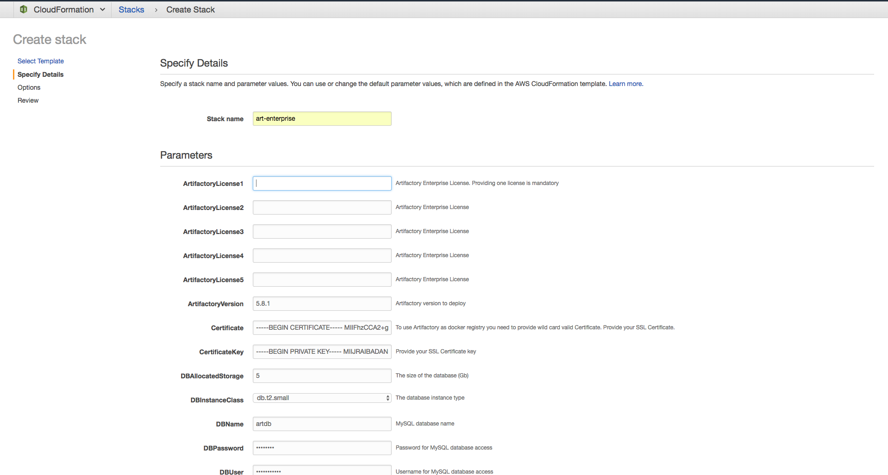

4. Click **Next**. 

5. Select the check box to allow CloudFormation to create an IAM user for Artifactory to access S3 bucket.
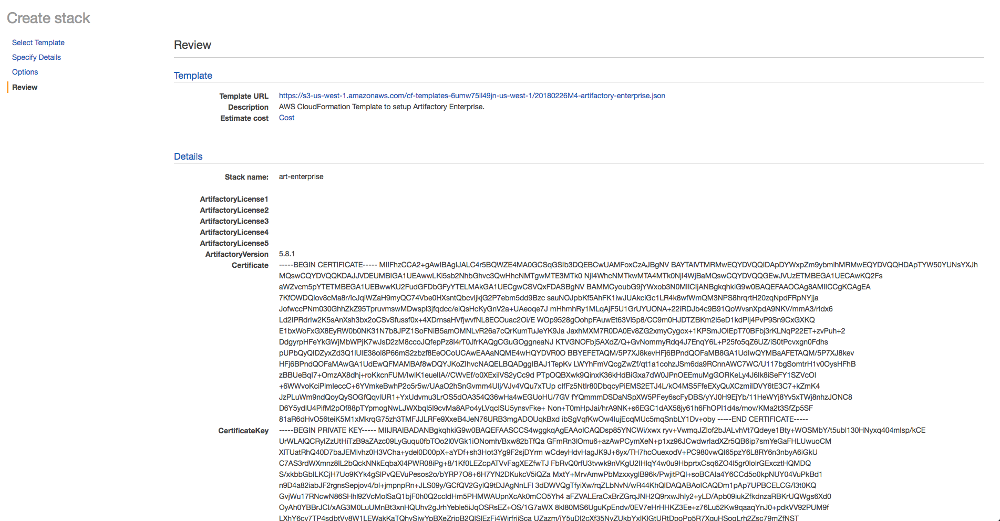

   Once the stack in deployed, you will see the Artifactory Load Balancer URL in the output . 
   It takes between 7 to 10 minutes for Artifactory to start and attach the instance to ELB. 
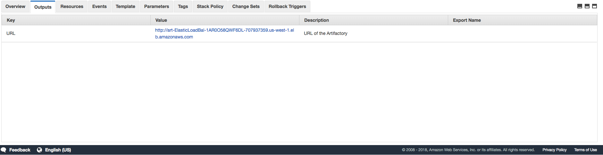

6. Open the Artifactory URL to see Artifactory UI. 
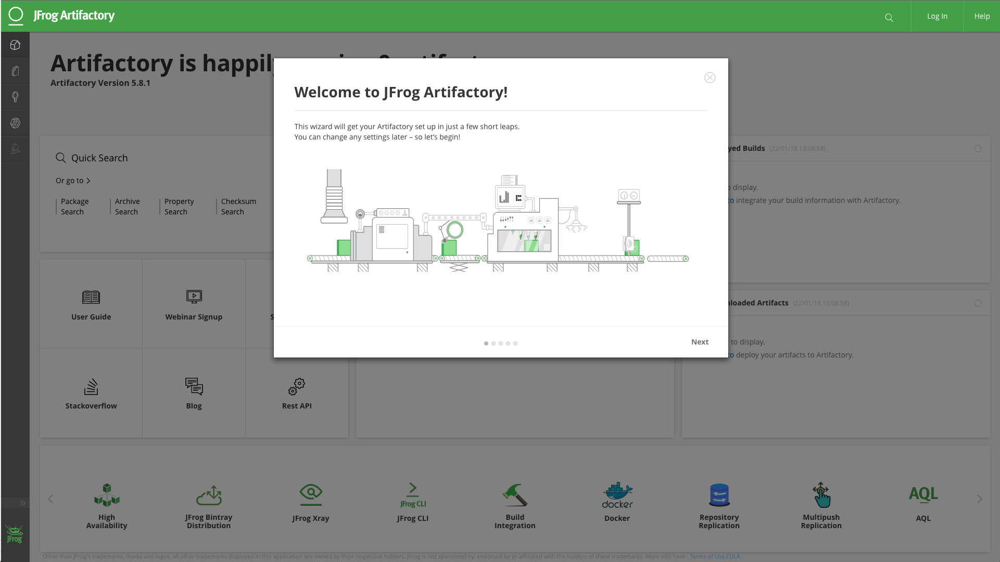
    
7. Verify that Artifactory is running in High Availability mode. In the Artifactory UI, navigate to to **Admin> High Availability**.
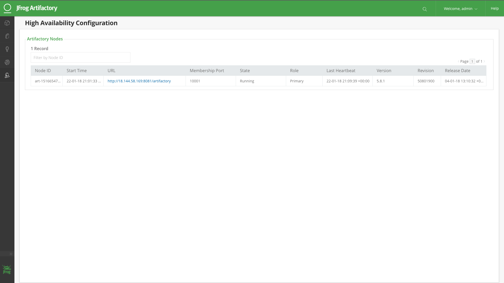

8. Now let's add two more nodes to the Artifactory Enterprise cluster. 
   Go to CloudFormation UI in AWS console and select the newly deployed Artifactory Enterprise Stack. 
   
   Click **Action > Update Stack**. 
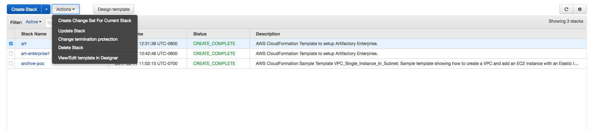

9. Increase the SecondaryNodeCount from 0 to 2 and then update the stack. 
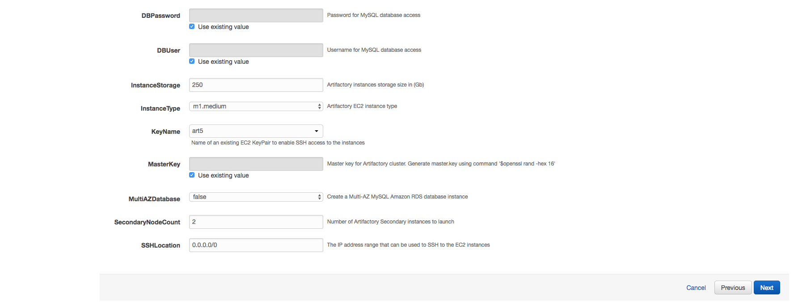

    It will take few minutes to update stack.
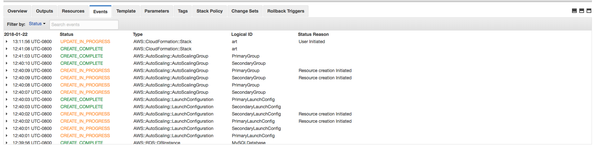

    The stack is updated.
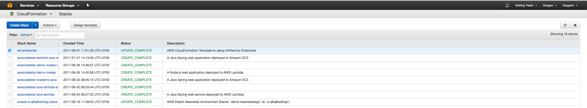

10. View the three nodes in the High Availability table in the Artifactory UI as part of Enterprise cluster. 
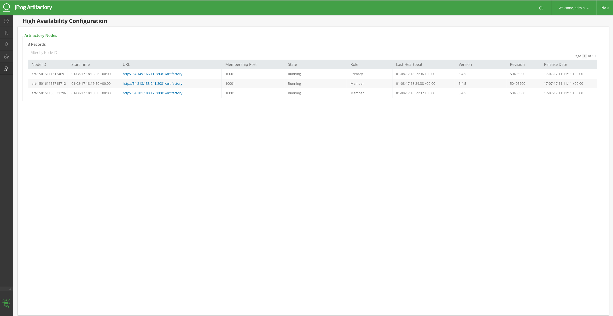

### Note: 
1. This template only supports Artifactory version 5.8.x and above.
2. Turn off daily backups. Read the [Documentation](https://www.jfrog.com/confluence/display/RTF/Managing+Backups).
   **Note**: In this template as default S3 is default filestore and data is persisted in S3. If you keep daily backups on disk space (default 250Gb) will get occupied quickly. 
3. Use an SSL Certificate with a valid wild card to use Artifactory as a Docker registry using the  subdomain method.

### Steps to setup Artifactory as a secure Docker Registry
Prerequisite:
* SSL certificate.

considering you have SSL certificate for `*.jfrog.team`
1. Pass your SSL Certificate in the`Certificate` parameter as string
2. Pass your SSL Certificate Key in the `CertificateKey` parameter as string
3. Set `CertificateDomain` as `jfrog.team`
4. If you want to access artifactory with `https://artifactory.jfrog.team`. Set `ArtifactoryServerName` as `artifactory` 
   Create DNS for example Route53 with entry `artifactory.jfrog.team` pointing to ELB value provided as output in CloudFormation Stack.
6. Create DNS for example Route53 with entry `*.jfrog.team` pointing to ELB value provided as output in CloudFormation Stack.
7. If you have virtual docker registry with name `docker-virtual` in artifactory. You can access it via `docker-virtual.jfrog.team`
   e.g ```docker pull docker-virtual.jfrog.team/nginx```

### Steps to upgrade the Artifactory Version

1. Go to the AWS Console and select the CloudFormation Artifactory Stack you want to upgrade. 

2. Click **Update Stack**.

3. Change the Artifactory version in the parameters from old version to version you want to deploy.
   For example: From. 5.8.1 to 5.8.2
   
   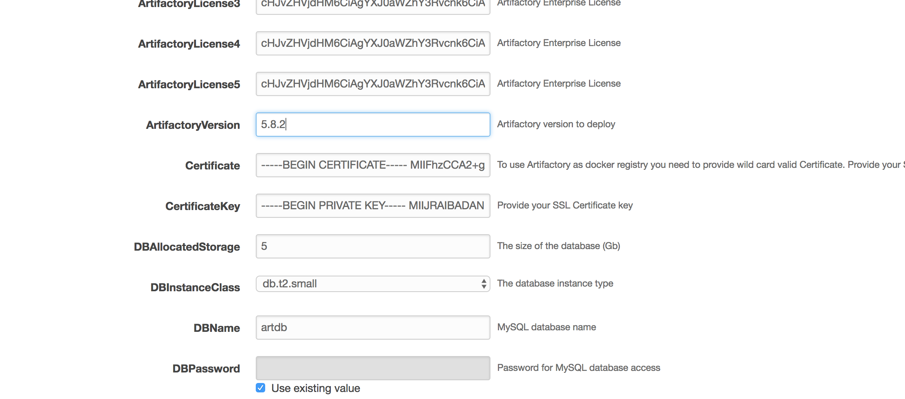
   
3. You will see the instances upgraded one by one. Depending on your cluster size it can take between 20-30 minutes to update the stack.

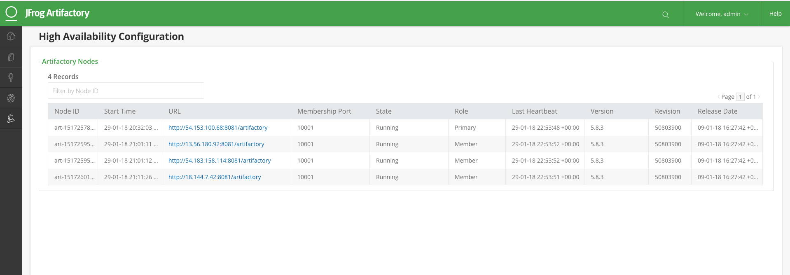
